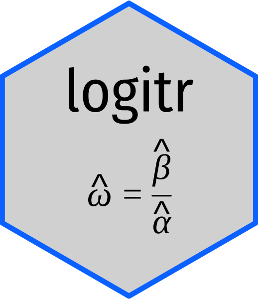

<!-- README.md is generated from README.Rmd. Please edit that file -->

```{r, include = FALSE}
knitr::opts_chunk$set(
  collapse   = TRUE,
  warning    = FALSE,
  message    = FALSE,
  comment    = "#>",
  fig.path   = "man/figures/",
  fig.retina = 3
)
```

# logitr <a href='https://jhelvy.github.io/logitr/'></a>

<!-- badges: start -->
[](https://www.tidyverse.org/lifecycle/#maturing)
[](https://CRAN.R-project.org/package=logitr)
[](https://travis-ci.com/jhelvy/logitr)
<!-- badges: end -->

Estimation of multinomial (MNL) and mixed logit (MXL) models in R with "Preference" space or "Willingness-to-pay" (WTP) space [utility parameterizations](https://jhelvy.github.io/logitr/articles/utility_models.html).

The latest version includes support for:

- Homogeneous multinomial logit (MNL) models
- Heterogeneous mixed logit (MXL) models (with normal and log-normal parameter distributions).
- Preference space utility parameterization.
- WTP space utility parameterization.
- An option to run a multistart optimization loop that uses different random starting points in each iteration (useful for non-convex problems like MXL models or models with WTP space parameterizations).
- Computing and comparing WTP from both preference space and WTP space models.
- Simulating the expected shares of a set of alternatives using an estimated model.

Note: MXL models assume uncorrelated heterogeneity covariances and are estimated using maximum simulated likelihood based on the algorithms in Kenneth Train's book [*Discrete Choice Methods with Simulation, 2nd Edition (New York: Cambridge University Press, 2009)*](https://eml.berkeley.edu/books/choice2.html).

## Installation

```{r child="man/rmdchunks/installation.Rmd"}
```

## Basic Usage

View the [basic usage](https://jhelvy.github.io/logitr/articles/basic_usage.html) page for details on how to use **logitr** to estimate models.

## Author, Version, and License Information

- Author: *John Paul Helveston* [www.jhelvy.com](http://www.jhelvy.com/)
- Date First Written: *Sunday, September 28, 2014*
- Most Recent Update: `r format(Sys.Date(), format="%B %d, %Y")`
- License: [MIT](https://github.com/jhelvy/logitr/blob/master/LICENSE.md)

## Citation Information

If you use this package for in a publication, I would greatly appreciate it if you cited it - you can get the citation by typing `citation("logitr")` into R:

```{r}
citation("logitr")
```
