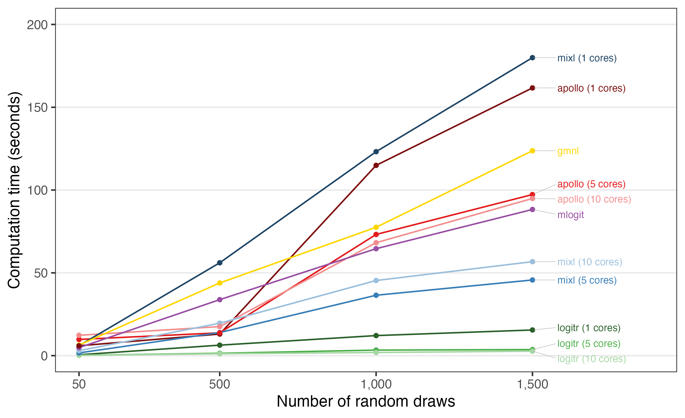
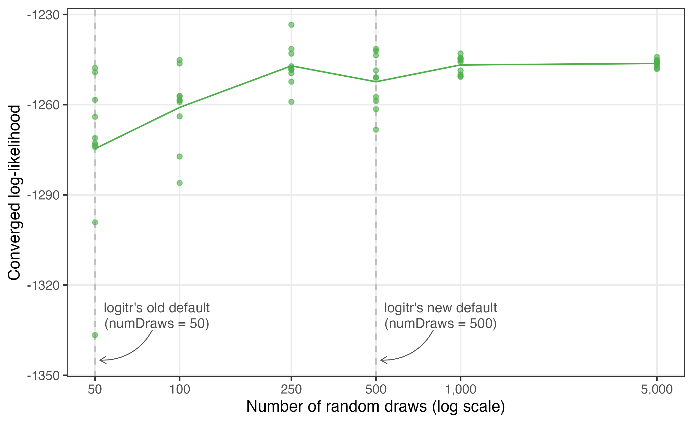

# Benchmarking estimation speed against other packages

{logitr} is considerably faster than other packages with similar
functionality. To demonstrate this, a benchmark was conducted by
estimating the same preference space mixed logit model using the
following R packages:

- {logitr}
- {mixl}
- {mlogit}
- {gmnl}
- {apollo}

Because {logitr} estimates mixed logit models using a compiled,
multithreaded backend, its speed also depends on the number of cores
available. To make the comparison fair, every package is benchmarked
single-threaded, and every package that can use multiple cores
({logitr}, {apollo}, and {mixl}) is *also* benchmarked at higher core
counts, denoted in parentheses, e.g. `logitr (1 cores)` versus
`logitr (10 cores)`. One caveat for {mixl}: it multithreads via OpenMP,
which the default macOS toolchain (Apple clang) does not provide, so
enabling it on a Mac requires a one-time toolchain setup (documented in
the header of the benchmark script).

The benchmark script is at
[`data-raw/runtimes.R`](https://github.com/jhelvy/logitr/blob/master/data-raw/runtimes.R)
in the package repository. The `runtimes` data frame records the version
of each package used; the results shipped with the package were produced
locally on a 10-core Apple M-series Mac using these versions:

| package | version |
|:--------|:--------|
| logitr  | 1.2.0   |
| mixl    | 1.3.5   |
| mlogit  | 2.0.0   |
| gmnl    | 1.1.3.2 |
| apollo  | 0.3.7   |

Benchmarks will always vary for every run of a benchmarking code, even
on the same machine, due to variations in background processes and the
number of cores available. So if you run this code yourself, your
results may vary, though the overall order and trends in each package’s
relative speed should be similar. These particular results are specific
to the machine they were run on – a 10-core Apple M-series Mac – so the
multi-core rows reflect that core count, and the exact package versions
used are recorded in the `version` column of the `runtimes` data frame.

## Comparing run times

The {logitr} package includes a `runtimes` data frame with the benchmark
results. The tables below summarize the run times (in seconds) for each
package and how many times slower each is relative to single-threaded
{logitr} (`logitr (1 cores)`), which is used as the reference point for
a fair, hardware-independent comparison.

``` r

library(logitr)
library(dplyr)
library(tidyr)
library(kableExtra) # For tables

times <- runtimes %>% select(-version)
logitr_time <- times %>%
    filter(package == "logitr (1 cores)") %>%
    rename(time_logitr = time_sec)
time_compare <- times %>%
    left_join(select(logitr_time, -package), by = "numDraws") %>%
    mutate(mult = round(time_sec / time_logitr, 1)) 
# Compare raw times (seconds)
time_compare %>%
    select(package, numDraws, time_sec) %>%
    mutate(time_sec = round(time_sec, 1)) %>%
    pivot_wider(names_from = numDraws, values_from = time_sec) %>%
    kbl()
```

| package           |   50 |  500 |  1000 |  1500 |
|:------------------|-----:|-----:|------:|------:|
| logitr (1 cores)  |  0.5 |  6.3 |  12.1 |  15.5 |
| logitr (5 cores)  |  0.2 |  1.4 |   3.4 |   3.7 |
| logitr (10 cores) |  0.2 |  1.2 |   1.9 |   2.7 |
| mixl (1 cores)    |  6.0 | 56.1 | 123.2 | 180.0 |
| mixl (5 cores)    |  1.7 | 14.0 |  36.5 |  45.7 |
| mixl (10 cores)   |  3.0 | 19.6 |  45.4 |  56.7 |
| mlogit            |  4.8 | 33.8 |  64.6 |  88.3 |
| gmnl              |  6.4 | 43.9 |  77.5 | 123.7 |
| apollo (1 cores)  |  6.0 | 13.1 | 114.9 | 161.7 |
| apollo (5 cores)  |  9.8 | 13.8 |  73.2 |  97.3 |
| apollo (10 cores) | 12.3 | 17.6 |  68.2 |  94.9 |

Now compare how many times slower each is relative to single-threaded
{logitr} (`logitr (1 cores)`), the fair, hardware-independent reference
point:

``` r

time_compare %>%
    select(package, numDraws, mult) %>%
    pivot_wider(names_from = numDraws, values_from = mult) %>%
    kbl()
```

| package           |   50 | 500 | 1000 | 1500 |
|:------------------|-----:|----:|-----:|-----:|
| logitr (1 cores)  |  1.0 | 1.0 |  1.0 |  1.0 |
| logitr (5 cores)  |  0.4 | 0.2 |  0.3 |  0.2 |
| logitr (10 cores) |  0.4 | 0.2 |  0.2 |  0.2 |
| mixl (1 cores)    | 11.3 | 8.8 | 10.2 | 11.6 |
| mixl (5 cores)    |  3.1 | 2.2 |  3.0 |  2.9 |
| mixl (10 cores)   |  5.6 | 3.1 |  3.7 |  3.7 |
| mlogit            |  9.0 | 5.3 |  5.3 |  5.7 |
| gmnl              | 12.0 | 6.9 |  6.4 |  8.0 |
| apollo (1 cores)  | 11.1 | 2.1 |  9.5 | 10.4 |
| apollo (5 cores)  | 18.3 | 2.2 |  6.0 |  6.3 |
| apollo (10 cores) | 23.0 | 2.8 |  5.6 |  6.1 |

The figure below visualizes the run times. All of the figures in this
article are generated by the
[`data-raw/figures.R`](https://github.com/jhelvy/logitr/blob/master/data-raw/figures.R)
script in the package repository.



Note that the estimation times reflect both the cost per iteration
(which grows with the number of draws) *and* the number of iterations
each package’s optimizer takes to converge, which can itself vary with
the number of draws. This is why some packages – particularly {apollo} –
show run times that are not strictly increasing in the number of draws.
The overall comparison is robust to this: {logitr} is dramatically
faster across every draw count, and its advantage grows with more draws
and more cores.

## Scaling to large draw counts

The comparison above stops at 1,500 draws because that is roughly where
the other packages become impractically slow. {logitr}, by contrast,
scales comfortably to 10,000 draws, which can be useful when many random
parameters demand a large simulation sample for a stable simulated
log-likelihood. The figure below isolates {logitr} and shows how its
full-fit estimation time grows with the number of draws for each of its
three backends:

- `cpu` – the native R path (memory-safe, single-threaded),
- `cpp (1 core)` – the compiled backend on a single core, and
- `cpp (10 cores)` – the compiled backend on all 10 cores.

These results are stored in the `runtimes_draws` data frame and
generated by the same
[`data-raw/runtimes.R`](https://github.com/jhelvy/logitr/blob/master/data-raw/runtimes.R)
script, run on the same 10-core Apple M-series machine as the
cross-package benchmark above.

``` r

runtimes_draws %>%
    mutate(time_sec = round(time_sec, 1)) %>%
    pivot_wider(names_from = numDraws, values_from = time_sec) %>%
    kbl()
```

| config         | 100 |  500 | 1000 |  2500 |  5000 | 10000 |
|:---------------|----:|-----:|-----:|------:|------:|------:|
| cpu            | 4.7 | 28.7 | 57.0 | 184.0 | 245.3 | 502.3 |
| cpp (1 core)   | 1.1 |  6.3 | 12.0 |  29.2 |  58.3 | 111.3 |
| cpp (10 cores) | 0.3 |  1.1 |  2.5 |   4.3 |   7.8 |  17.8 |


The compiled backend is several times faster than the native R path at
every draw count, and adding cores multiplies that advantage further –
so even at 10,000 draws, a model that is essentially out of reach for
the other packages estimates in a fraction of the time.

## What the speed buys you: a stable log-likelihood

Speed is not the end goal – it is what makes *enough draws* affordable.
The mixed logit log-likelihood is approximated by simulation, so any
estimate carries simulation error that shrinks as the number of draws
grows. Historical defaults are small: {mlogit} and {gmnl} default to 40
draws, Stata’s `mixlogit` to 50, and {logitr} itself defaulted to 50
prior to version 1.2.0. Those defaults date from when estimation was
slow enough that more draws felt like a luxury, but they leave enough
simulation noise in the log-likelihood to matter.

To make that noise visible, the same mixed logit model used in the
benchmarks above was estimated repeatedly at increasing draw counts. At
each draw count the model was estimated 10 times using randomized MLHS
draws with a different seed each time, with every run starting from the
same converged reference solution – so at a given draw count, the
across-seed spread in the converged log-likelihood reflects simulation
error: the noise in the simulated log-likelihood shifts the converged
value, and at low draw counts it can distort the surface enough that
some runs converge to different local optima entirely. The results ship
with the package in the `loglik_draws` data frame, generated by the same
[`data-raw/runtimes.R`](https://github.com/jhelvy/logitr/blob/master/data-raw/runtimes.R)
script (run on the same 10-core machine as above).

``` r

loglik_summary <- loglik_draws %>%
    group_by(numDraws) %>%
    summarise(
        min = min(logLik),
        max = max(logLik),
        range = max(logLik) - min(logLik),
        sd = sd(logLik),
        median_time_sec = median(time_sec)
    ) %>%
    mutate(across(min:median_time_sec, \(x) round(x, 1)))

kbl(loglik_summary)
```

| numDraws |     min |     max | range |   sd | median_time_sec |
|---------:|--------:|--------:|------:|-----:|----------------:|
|       50 | -1336.6 | -1247.8 |  88.8 | 26.3 |             0.3 |
|      100 | -1286.0 | -1245.1 |  40.9 | 12.5 |             0.3 |
|      250 | -1259.1 | -1233.4 |  25.6 |  6.8 |             0.5 |
|      500 | -1268.3 | -1241.4 |  26.9 |  9.0 |             0.7 |
|     1000 | -1250.8 | -1243.0 |   7.8 |  2.9 |             1.1 |
|     5000 | -1248.1 | -1244.1 |   4.0 |  1.3 |             4.2 |



At 50 draws the converged log-likelihood ranges over about 89 units
across seeds – easily enough to flip a likelihood-based model comparison
– while at 500 draws the spread is roughly 3.3 times smaller and keeps
narrowing from there. (The narrowing is not perfectly monotonic – with
few draws, an occasional run wanders to a different local optimum, which
is itself a symptom of the simulation noise, but the trend is
unmistakable.) And because of the compiled backend, those 500 draws cost
only about 0.7 seconds on this model. This is why {logitr} defaults to
`numDraws = 500`: at these speeds there is no longer a good reason to
accept the simulation noise of a 40-50 draw default.
