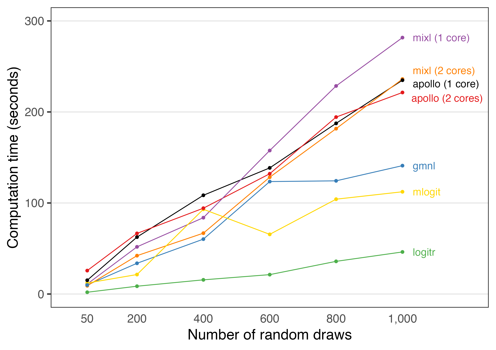

# Benchmarking estimation speed against other packages

{logitr} is faster than most other packages with similar functionality.
To demonstrate this, a benchmark was conducted by estimating the same
preference space mixed logit model using the following R packages:

- {logitr}
- {mixl}
- {mlogit}
- {gmnl}
- {apollo}

The benchmark can be viewed at this Google Colab notebook:

<https://colab.research.google.com/drive/1vYlBdJd4xCV43UwJ33XXpO3Ys8xWkuxx?usp=sharing>

Benchmarks will always vary for every run of a benchmarking code, even
when run on the same machine due to variations in background processes.
Thus, if you run this code yourself on a different machine, your results
may vary, though the overall order and trends in terms of each package’s
relative speed should be similar to those from the Colab notebook.

## Comparing run times

The {logitr} package includes a `runtimes` data frame that is exported
from the [Google
Colab](https://colab.research.google.com/drive/1vYlBdJd4xCV43UwJ33XXpO3Ys8xWkuxx?usp=sharing)
notebook used to conduct the benchmark. The tables below summarize the
run times for each package and how many times slower they are relative
to {logitr}.

``` r
library(logitr)
library(dplyr)
library(tidyr)
library(kableExtra) # For tables

numDraws <- unique(runtimes$numDraws)
logitr_time <- runtimes %>%
    filter(package == "logitr") %>%
    rename(time_logitr = time_sec)
time_compare <- runtimes %>%
    left_join(select(logitr_time, -package), by = "numDraws") %>%
    mutate(mult = round(time_sec/ time_logitr, 1)) %>%
    select(-time_logitr)
# Compare raw times
time_compare %>%
    select(-mult) %>%
    pivot_wider(names_from = numDraws, values_from = time_sec) %>% 
    kbl()
```

| package          |        50 |       200 |      400 |       600 |       800 |      1000 |
|:-----------------|----------:|----------:|---------:|----------:|----------:|----------:|
| logitr           |  2.752860 |  8.930408 | 13.72697 |  24.13735 |  33.47056 |  39.22012 |
| mixl (1 core)    | 10.640267 | 49.667703 | 80.22922 | 158.23673 | 229.17401 | 271.35824 |
| mixl (2 cores)   |  8.928487 | 41.577738 | 66.05436 | 129.84954 | 184.54557 | 230.91617 |
| mlogit           | 11.926502 | 19.901097 | 87.58429 |  60.38106 | 100.63138 |  98.41650 |
| gmnl             | 10.553787 | 31.379011 | 69.74575 | 121.93843 |  99.23701 | 141.36727 |
| apollo (1 core)  | 17.287605 | 44.118732 | 84.29395 | 129.33302 | 164.37400 | 198.21812 |
| apollo (2 cores) | 21.911355 | 53.223971 | 82.69647 | 120.27101 | 163.80518 | 196.84896 |

``` r
# Compare how many times slower compared to logitr
time_compare %>%
    select(-time_sec) %>%
    pivot_wider(names_from = numDraws, values_from = mult) %>% 
    kbl()
```

| package          |  50 | 200 | 400 | 600 | 800 | 1000 |
|:-----------------|----:|----:|----:|----:|----:|-----:|
| logitr           | 1.0 | 1.0 | 1.0 | 1.0 | 1.0 |  1.0 |
| mixl (1 core)    | 3.9 | 5.6 | 5.8 | 6.6 | 6.8 |  6.9 |
| mixl (2 cores)   | 3.2 | 4.7 | 4.8 | 5.4 | 5.5 |  5.9 |
| mlogit           | 4.3 | 2.2 | 6.4 | 2.5 | 3.0 |  2.5 |
| gmnl             | 3.8 | 3.5 | 5.1 | 5.1 | 3.0 |  3.6 |
| apollo (1 core)  | 6.3 | 4.9 | 6.1 | 5.4 | 4.9 |  5.1 |
| apollo (2 cores) | 8.0 | 6.0 | 6.0 | 5.0 | 4.9 |  5.0 |

The code below plots the relative run times from the Colab notebook.

``` r
library(ggplot2)
library(ggrepel)

plotColors <- c("black", RColorBrewer::brewer.pal(n = 5, name = "Set1"), "gold")
benchmark <- runtimes %>% 
    ggplot(aes(x = numDraws, y = time_sec, color = package)) +
    geom_line() +
    geom_point() +
    geom_text_repel(
        data = . %>% filter(numDraws == max(numDraws)),
        aes(label = package),
        hjust = 0, nudge_x = 40, direction = "y",
        size = 4.5, segment.size = 0
    ) +
    scale_x_continuous(
        limits = c(0, 1200),
        breaks = numDraws,
        labels = scales::comma) +
    scale_y_continuous(limits = c(0, 300), breaks = seq(0, 300, 100)) +
    scale_color_manual(values = plotColors) +
    guides(
        point = guide_legend(override.aes = list(label = "")),
        color = guide_legend(override.aes = list(label = ""))) +
    theme_bw(base_size = 18) +
    theme(
        panel.grid.minor = element_blank(),
        panel.grid.major.x = element_blank(),
        legend.position = "none",
        axis.line.x = element_blank(),
        axis.ticks.x = element_blank()
    ) +
    labs(
        x = "Number of random draws",
        y = "Computation time (seconds)"
    )

benchmark
```


