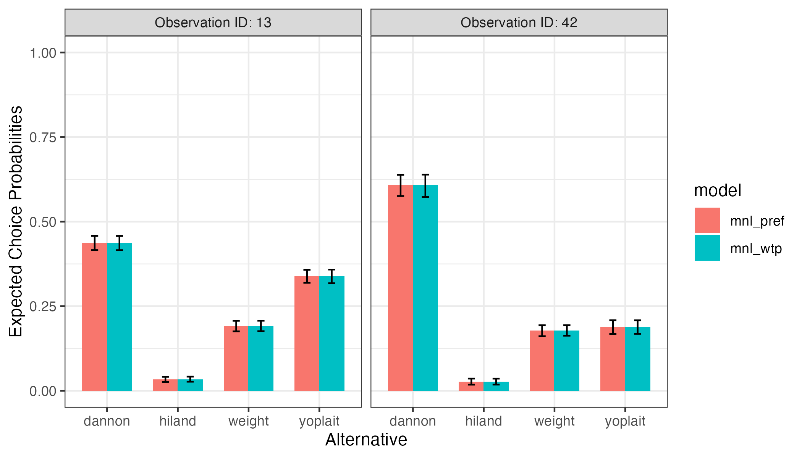

# Predicting Probabilities and Outcomes with Estimated Models

Once a model has been estimated, it can be used to predict probabilities
and / or outcomes for a set of alternatives. This vignette demonstrates
examples of how to so using the
[`predict()`](https://rdrr.io/r/stats/predict.html) method along with an
estimated model.

You can make predictions for any set of alternatives, so long as the
columns in the alternatives correspond to estimated coefficients in your
model. By default, if no new data are provided via the `newdata`
argument, then predictions will be made for the original data used to
estimate the model.

Predictions can be made using both preference space and WTP space
models, as well as multinomial logit and mixed logit models. For mixed
logit models, heterogeneity is modeled by simulating draws from the
population estimates of the estimated model.

## Predicting probabilities

### Preference space models

In the example below, a preference space MNL model is estimated
(`mnl_pref`) and then used to predict probabilities for the data used to
estimate the model:

``` r
library("logitr")

mnl_pref <- logitr(
  data    = yogurt,
  outcome = 'choice',
  obsID   = 'obsID',
  pars    = c('price', 'feat', 'brand')
)

probs <- predict(mnl_pref)
head(probs)
#>   obsID predicted_prob
#> 1     1     0.41802407
#> 2     1     0.02118240
#> 3     1     0.23691737
#> 4     1     0.32387615
#> 5     2     0.26643822
#> 6     2     0.02255486
```

The [`predict()`](https://rdrr.io/r/stats/predict.html) method returns a
data frame containing the observation ID as well as the predicted
probabilities. The original data can also be returned in the data frame
by setting `returnData = TRUE`:

``` r
probs <- predict(mnl_pref, returnData = TRUE)
head(probs)
#>   obsID predicted_prob price feat brandhiland brandweight brandyoplait choice
#> 1     1     0.41802407   8.1    0           0           0            0      0
#> 2     1     0.02118240   6.1    0           1           0            0      0
#> 3     1     0.23691737   7.9    0           0           1            0      1
#> 4     1     0.32387615  10.8    0           0           0            1      0
#> 5     2     0.26643822   9.8    0           0           0            0      1
#> 6     2     0.02255486   6.4    0           1           0            0      0
```

To make predictions for a new set of alternatives, use the `newdata`
argument. The example below makes predictions for just two of the choice
observations from the `yogurt` dataset:

``` r
data <- subset(
  yogurt, obsID %in% c(42, 13),
  select = c('obsID', 'alt', 'price', 'feat', 'brand'))

probs_mnl_pref <- predict(
  mnl_pref,
  newdata = data,
  obsID = "obsID"
)

probs_mnl_pref
#>     obsID predicted_prob
#> 49     13     0.43685145
#> 50     13     0.03312986
#> 51     13     0.19155548
#> 52     13     0.33846321
#> 165    42     0.60764778
#> 166    42     0.02602007
#> 167    42     0.17803313
#> 168    42     0.18829902
```

Upper and lower bounds of a confidence interval for predicted
probabilities can be obtained by setting `interval = "confidence"`, and
the tolerance level (0 to 1) is set with the `level` argument (defaults
to 0.95). Intervals are estimated using the Krinsky and Robb parametric
bootstrapping method (Krinsky and Robb 1986). For example, a 95% CI is
obtained with the following:

``` r
probs_mnl_pref <- predict(
  mnl_pref,
  newdata = data,
  obsID = "obsID",
  interval = "confidence",
  level = 0.95
)

probs_mnl_pref
#>     obsID predicted_prob predicted_prob_lower predicted_prob_upper
#> 49     13     0.43685145           0.41531882           0.45781528
#> 50     13     0.03312986           0.02641062           0.04145166
#> 51     13     0.19155548           0.17631579           0.20767134
#> 52     13     0.33846321           0.31843584           0.35880858
#> 165    42     0.60764778           0.57215830           0.64005061
#> 166    42     0.02602007           0.01839510           0.03687359
#> 167    42     0.17803313           0.16214868           0.19488167
#> 168    42     0.18829902           0.16837249           0.20967085
```

### WTP space models

WTP space models can also be used to predict probabilities. In the
example below, a WTP space model is estimated and used to predict
probabilities for the same `data` data frame as in the previous
examples:

``` r
mnl_wtp <- logitr(
  data     = yogurt,
  outcome  = 'choice',
  obsID    = 'obsID',
  pars     = c('feat', 'brand'),
  scalePar = 'price',
  numMultiStarts = 10
)

probs_mnl_wtp <- predict(
  mnl_wtp,
  newdata  = data,
  obsID    = "obsID",
  interval = "confidence"
)

probs_mnl_wtp
#>     obsID predicted_prob predicted_prob_lower predicted_prob_upper
#> 49     13     0.43686141           0.41551327           0.45747039
#> 50     13     0.03312947           0.02641714           0.04231684
#> 51     13     0.19154829           0.17587927           0.20730602
#> 52     13     0.33846083           0.31857077           0.35854611
#> 165    42     0.60767120           0.57326014           0.63983775
#> 166    42     0.02601800           0.01853595           0.03664343
#> 167    42     0.17802364           0.16178241           0.19419803
#> 168    42     0.18828717           0.16779266           0.20839887
```

Here is a bar chart comparing the predicted probabilities from the
preference space and WTP space models. Since both models are equivalent
except in different spaces, the predicted probabilities are identical:

``` r
library("ggplot2")

probs <- rbind(probs_mnl_pref, probs_mnl_wtp)
probs$model <- c(rep("mnl_pref", 8), rep("mnl_wtp", 8))
probs$alt <- rep(c("dannon", "hiland", "weight", "yoplait"), 4)
probs$obs <- paste0("Observation ID: ", probs$obsID)
ggplot(probs, aes(x = alt, y = predicted_prob, fill = model)) +
    geom_bar(stat = 'identity', width = 0.7, position = "dodge") +
    geom_errorbar(aes(ymin = predicted_prob_lower, ymax = predicted_prob_upper),
                  width = 0.2, position = position_dodge(width = 0.7)) +
    facet_wrap(vars(obs)) +
    scale_y_continuous(limits = c(0, 1)) +
    labs(x = 'Alternative', y = 'Expected Choice Probabilities') +
    theme_bw()
```



## Predicting outcomes

The [`predict()`](https://rdrr.io/r/stats/predict.html) method can also
be used to predict outcomes by setting `type = "outcome"` (the default
is `"prob"` for predicting probabilities). In the examples below,
outcomes are predicted using the same preference space and WTP space
models as in the previous examples. The `returnData` argument is also
set to `TRUE` so that the predicted outcomes can be compared to the
actual choices made:

``` r
outcomes_pref <- predict(
    mnl_pref, 
    type = "outcome", 
    returnData = TRUE
)

head(outcomes_pref)
#>   obsID predicted_outcome price feat brandhiland brandweight brandyoplait
#> 1     1                 0   8.1    0           0           0            0
#> 2     1                 0   6.1    0           1           0            0
#> 3     1                 1   7.9    0           0           1            0
#> 4     1                 0  10.8    0           0           0            1
#> 5     2                 1   9.8    0           0           0            0
#> 6     2                 0   6.4    0           1           0            0
#>   choice
#> 1      0
#> 2      0
#> 3      1
#> 4      0
#> 5      1
#> 6      0

outcomes_wtp <- predict(
    mnl_wtp, 
    type = "outcome", 
    returnData = TRUE
)

head(outcomes_wtp)
#>   obsID predicted_outcome feat brandhiland brandweight brandyoplait scalePar
#> 1     1                 1    0           0           0            0      8.1
#> 2     1                 0    0           1           0            0      6.1
#> 3     1                 0    0           0           1            0      7.9
#> 4     1                 0    0           0           0            1     10.8
#> 5     2                 1    0           0           0            0      9.8
#> 6     2                 0    0           1           0            0      6.4
#>   choice
#> 1      0
#> 2      0
#> 3      1
#> 4      0
#> 5      1
#> 6      0
```

The accuracy of each model can be computed by dividing the number of
correctly predicted choices by the total number of choices:

``` r
chosen_pref <- subset(outcomes_pref, choice == 1)
chosen_pref$correct <- chosen_pref$choice == chosen_pref$predicted_outcome
accuracy_pref <- sum(chosen_pref$correct) / nrow(chosen_pref)
accuracy_pref
#> [1] 0.3909619

chosen_wtp <- subset(outcomes_wtp, choice == 1)
chosen_wtp$correct <- chosen_wtp$choice == chosen_wtp$predicted_outcome
accuracy_wtp <- sum(chosen_wtp$correct) / nrow(chosen_wtp)
accuracy_wtp
#> [1] 0.356136
```

These results show that both models correctly predicted choice for
approximately 39% of the observations in the `yogurt` data frame, which
is significantly better than random (25%).

## References

Krinsky, Itzhak, and A Leslie Robb. 1986. “On Approximating the
Statistical Properties of Elasticities.” *The Review of Economics and
Statistics*, 715–19.
