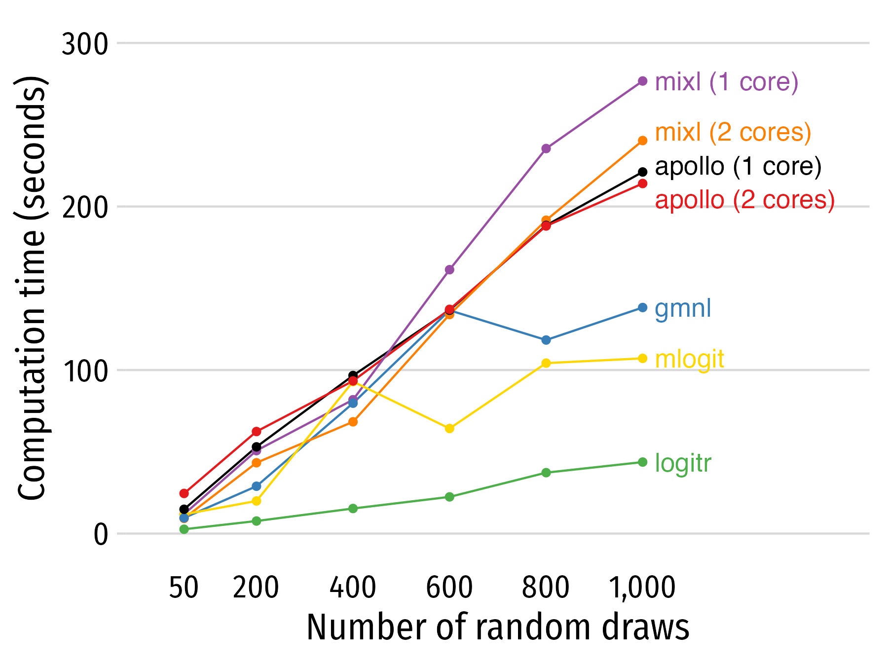

```{r setup, include=FALSE}
knitr::opts_chunk$set(
  warning = FALSE,
  message = FALSE,
  fig.width = 7.252,
  fig.height = 4,
  comment = "#>",
  fig.retina = 3
)
```

{logitr} is faster than most other packages with similar functionality. To demonstrate this, a benchmark was conducted by estimating the same preference space mixed logit model using the following R packages:

- {logitr}
- {mixl}
- {mlogit}
- {gmnl}
- {apollo}

The benchmark can be viewed at this Google Colab notebook:

https://colab.research.google.com/drive/1vYlBdJd4xCV43UwJ33XXpO3Ys8xWkuxx?usp=sharing

Benchmarks will always vary for every run of a benchmarking code, even when run on the same machine due to variations in background processes. Thus, if you run this code yourself on a different machine, your results may vary, though the overall order and trends in terms of each package's relative speed should be similar to those from the Colab notebook.

## Comparing run times 

The {logitr} package includes a `runtimes` data frame that is exported from the [Google Colab](https://colab.research.google.com/drive/1vYlBdJd4xCV43UwJ33XXpO3Ys8xWkuxx?usp=sharing) notebook used to conduct the benchmark. The tables below summarize the run times for each package and how many times slower they are relative to {logitr}.

```{r}
library(logitr)
library(dplyr)
library(tidyr)
library(kableExtra) # For tables

numDraws <- unique(runtimes$numDraws)
logitr_time <- runtimes %>%
    filter(package == "logitr") %>%
    rename(time_logitr = time_sec)
time_compare <- runtimes %>%
    left_join(select(logitr_time, -package), by = "numDraws") %>%
    mutate(mult = round(time_sec/ time_logitr, 1)) %>%
    select(-time_logitr)
# Compare raw times
time_compare %>%
    select(-mult) %>%
    pivot_wider(names_from = numDraws, values_from = time_sec) %>% 
    kbl()
# Compare how many times slower compared to logitr
time_compare %>%
    select(-time_sec) %>%
    pivot_wider(names_from = numDraws, values_from = mult) %>% 
    kbl()
```

The code below plots the relative run times from the Colab notebook.

```{r, eval=FALSE}
library(ggplot2)
library(ggrepel)

plotColors <- c("black", RColorBrewer::brewer.pal(n = 5, name = "Set1"), "gold")
benchmark <- runtimes %>% 
    ggplot(aes(x = numDraws, y = time_sec, color = package)) +
    geom_line() +
    geom_point() +
    geom_text_repel(
        data = . %>% filter(numDraws == max(numDraws)),
        aes(label = package),
        hjust = 0, nudge_x = 40, direction = "y",
        size = 4.5, segment.size = 0
    ) +
    scale_x_continuous(
        limits = c(0, 1200),
        breaks = numDraws,
        labels = scales::comma) +
    scale_y_continuous(limits = c(0, 300), breaks = seq(0, 300, 100)) +
    scale_color_manual(values = plotColors) +
    guides(
        point = guide_legend(override.aes = list(label = "")),
        color = guide_legend(override.aes = list(label = ""))) +
    theme_bw(base_size = 18) +
    theme(
        panel.grid.minor = element_blank(),
        panel.grid.major.x = element_blank(),
        legend.position = "none",
        axis.line.x = element_blank(),
        axis.ticks.x = element_blank()
    ) +
    labs(
        x = "Number of random draws",
        y = "Computation time (seconds)"
    )

benchmark
```

```{r, eval=FALSE, echo=FALSE}
ggsave('benchmark.png', benchmark, width = 8.5, height = 6)
```

```{r probabilities, echo=FALSE}

```
