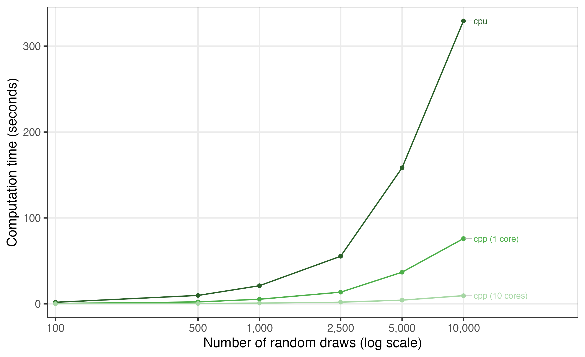

```{r setup, include=FALSE}
knitr::opts_chunk$set(
  warning = FALSE,
  message = FALSE,
  fig.width = 7.252,
  fig.height = 4,
  comment = "#>",
  fig.retina = 3
)
```

{logitr} is considerably faster than other packages with similar functionality. To demonstrate this, a benchmark was conducted by estimating the same preference space mixed logit model using the following R packages:

- {logitr}
- {mixl}
- {mlogit}
- {gmnl}
- {apollo}

Because {logitr} estimates mixed logit models using a compiled, multithreaded backend, its speed also depends on the number of cores available. To make the comparison fair, every package is benchmarked single-threaded, and every package that can use multiple cores ({logitr}, {apollo}, and {mixl}) is *also* benchmarked at higher core counts, denoted in parentheses, e.g. `logitr (1 cores)` versus `logitr (10 cores)`. One caveat for {mixl}: it multithreads via OpenMP, which the default macOS toolchain (Apple clang) does not provide, so enabling it on a Mac requires a one-time toolchain setup (documented in the header of the benchmark script).

The benchmark script is at [`data-raw/runtimes.R`](https://github.com/jhelvy/logitr/blob/master/data-raw/runtimes.R) in the package repository. The `runtimes` data frame records the version of each package used; the results shipped with the package were produced locally on a 10-core Apple M-series Mac using these versions:

```{r, echo = FALSE}
library(logitr)
library(dplyr)

runtimes %>%
    mutate(pkg = sub(" .*", "", package)) %>%
    distinct(pkg, version) %>%
    kableExtra::kbl(col.names = c("package", "version"))
```

Benchmarks will always vary for every run of a benchmarking code, even on the same machine, due to variations in background processes and the number of cores available. So if you run this code yourself, your results may vary, though the overall order and trends in each package's relative speed should be similar. These particular results are specific to the machine they were run on -- a 10-core Apple M-series Mac -- so the multi-core rows reflect that core count, and the exact package versions used are recorded in the `version` column of the `runtimes` data frame.

## Comparing run times 

The {logitr} package includes a `runtimes` data frame with the benchmark results. The tables below summarize the run times (in seconds) for each package and how many times slower each is relative to single-threaded {logitr} (`logitr (1 cores)`), which is used as the reference point for a fair, hardware-independent comparison.

```{r}
library(logitr)
library(dplyr)
library(tidyr)
library(kableExtra) # For tables

times <- runtimes %>% select(-version)
logitr_time <- times %>%
    filter(package == "logitr (1 cores)") %>%
    rename(time_logitr = time_sec)
time_compare <- times %>%
    left_join(select(logitr_time, -package), by = "numDraws") %>%
    mutate(mult = round(time_sec / time_logitr, 1)) 
# Compare raw times (seconds)
time_compare %>%
    select(package, numDraws, time_sec) %>%
    mutate(time_sec = round(time_sec, 1)) %>%
    pivot_wider(names_from = numDraws, values_from = time_sec) %>%
    kbl()
```

Now compare how many times slower each is relative to single-threaded {logitr} (`logitr (1 cores)`), the fair, hardware-independent reference point:

```{r}
time_compare %>%
    select(package, numDraws, mult) %>%
    pivot_wider(names_from = numDraws, values_from = mult) %>%
    kbl()
```

Visualize the run times:

```{r, eval=FALSE}
library(ggplot2)
library(ggrepel)

# n shades of a base color (dark -> light), derived from the base color itself
shades <- function(base, n = 3) {
  v <- grDevices::col2rgb(base)[, 1] / 255
  dark  <- grDevices::rgb(v[1]*.55, v[2]*.55, v[3]*.55)
  light <- grDevices::rgb(v[1]+(1-v[1])*.5, v[2]+(1-v[2])*.5, v[3]+(1-v[3])*.5)
  grDevices::colorRampPalette(c(dark, base, light))(n)
}
set1 <- RColorBrewer::brewer.pal(9, "Set1")

# Assign each package a base color; packages benchmarked at several core counts
# (logitr, apollo, mixl) get a dark -> light ramp (dark = fewest cores). Built
# from the data so it adapts to whatever core counts this machine produced.
baseColor <- c(logitr = set1[3],  # green
               apollo = set1[1],  # red
               mixl   = "gold",
               mlogit = "black",
               gmnl   = set1[2])  # blue
pkgOrder <- c("logitr", "apollo", "mixl", "mlogit", "gmnl")

lv <- character(0)
plotColors <- character(0)
for (pkg in pkgOrder) {
    labs <- runtimes %>%
        filter(sub(" .*", "", as.character(package)) == pkg) %>%
        distinct(package) %>%
        pull(package) %>%
        as.character()
    nCores <- as.integer(sub(".*\\(([0-9]+) cores\\)", "\\1", labs))
    labs <- labs[order(nCores, na.last = TRUE)]
    cols <- if (length(labs) == 1) {
        baseColor[[pkg]]
    } else {
        shades(baseColor[[pkg]], length(labs))
    }
    lv <- c(lv, labs)
    plotColors <- c(plotColors, cols)
}

benchmark <- runtimes %>%
    mutate(package = factor(as.character(package), levels = lv)) %>%
    ggplot(aes(x = numDraws, y = time_sec, color = package)) +
    geom_line() +
    geom_point(size = 1.5) +
    geom_text_repel(
        data = . %>% filter(numDraws == max(numDraws)),
        aes(label = package),
        hjust = 0, nudge_x = 80, direction = "y",
        size = 3.3, segment.size = 0.2, segment.color = "grey70"
    ) +
    scale_x_continuous(
        limits = c(0, 3100),
        breaks = c(50, 250, 500, 1000, 2000),
        labels = scales::comma) +
    scale_y_continuous(breaks = seq(0, 120, 20)) +
    scale_color_manual(values = plotColors) +
    theme_bw(base_size = 15) +
    theme(
        panel.grid.minor = element_blank(),
        panel.grid.major.x = element_blank(),
        legend.position = "none"
    ) +
    labs(
        x = "Number of random draws",
        y = "Computation time (seconds)"
    )

benchmark
```

```{r, eval=FALSE, echo=FALSE}
ggsave('benchmark.png', benchmark, width = 9, height = 5.5, dpi = 300)
```

```{r benchmark-figure, echo=FALSE, out.width="100%"}
knitr::include_graphics('benchmark.png')
```

Note that the estimation times reflect both the cost per iteration (which grows with the number of draws) *and* the number of iterations each package's optimizer takes to converge, which can itself vary with the number of draws. This is why some packages -- particularly {apollo} -- show run times that are not strictly increasing in the number of draws. The overall comparison is robust to this: {logitr} is dramatically faster across every draw count, and its advantage grows with more draws and more cores.

## Scaling to large draw counts

The comparison above stops at 2,000 draws because that is roughly where the other packages become impractically slow. {logitr}, by contrast, scales comfortably to 10,000 draws, which can be useful when many random parameters demand a large simulation sample for a stable simulated log-likelihood. The figure below isolates {logitr} and shows how its full-fit estimation time grows with the number of draws for each of its three backends:

- `cpu` -- the native R path (memory-safe, single-threaded),
- `cpp (1 core)` -- the compiled backend on a single core, and
- `cpp (10 cores)` -- the compiled backend on all 10 cores.

These results are stored in the `runtimes_draws` data frame and generated by the script [`data-raw/runtimes_draws.R`](https://github.com/jhelvy/logitr/blob/master/data-raw/runtimes_draws.R), run on the same 10-core Apple M-series machine as the cross-package benchmark above.

```{r}
runtimes_draws %>%
    mutate(time_sec = round(time_sec, 1)) %>%
    pivot_wider(names_from = numDraws, values_from = time_sec) %>%
    kbl()
```

```{r, eval=FALSE}
draws_plot <- runtimes_draws %>%
    ggplot(aes(x = numDraws, y = time_sec, color = config)) +
    geom_line() +
    geom_point(size = 1.5) +
    geom_text_repel(
        data = . %>% filter(numDraws == max(numDraws)),
        aes(label = config),
        hjust = 0, nudge_x = 0.05, direction = "y",
        size = 3.3, segment.size = 0.2, segment.color = "grey70"
    ) +
    scale_x_log10(
        breaks = c(100, 500, 1000, 2500, 5000, 10000),
        labels = scales::comma,
        expand = expansion(mult = c(0.02, 0.25))
    ) +
    scale_color_manual(values = shades(set1[3])) +
    theme_bw(base_size = 15) +
    theme(
        panel.grid.minor = element_blank(),
        legend.position = "none"
    ) +
    labs(
        x = "Number of random draws (log scale)",
        y = "Computation time (seconds)"
    )

draws_plot
```

```{r, eval=FALSE, echo=FALSE}
ggsave('benchmark_draws.png', draws_plot, width = 9, height = 5.5, dpi = 300)
```

```{r benchmark-draws-figure, echo=FALSE, out.width="100%"}

```

The compiled backend is several times faster than the native R path at every draw count, and adding cores multiplies that advantage further -- so even at 10,000 draws, a model that is essentially out of reach for the other packages estimates in a fraction of the time.
