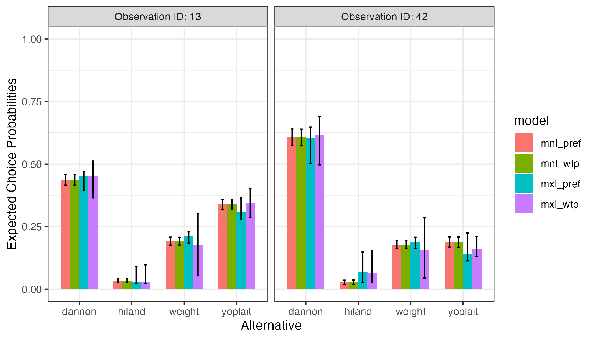

```{r setup, include=FALSE, message=FALSE, warning=FALSE}
knitr::opts_chunk$set(
  collapse = TRUE,
  warning = FALSE,
  message = FALSE,
  fig.path   = "figs/",
  fig.retina = 3,
  comment = "#>"
)
library(logitr)
# Read in results from already estimated models  so that the
# examples aren't actually run when building this page, otherwise it'll
# take much longer to build
probs_mnl_pref <- readRDS(here::here('inst', 'extdata', 'probs_mnl_pref.Rds'))
probs_mnl_wtp <- readRDS(here::here('inst', 'extdata', 'probs_mnl_wtp.Rds'))
probs_mxl_pref <- readRDS(here::here('inst', 'extdata', 'probs_mxl_pref.Rds'))
probs_mxl_wtp <- readRDS(here::here('inst', 'extdata', 'probs_mxl_wtp.Rds'))
```

Once a model has been estimated, it can be used to predict the expected choice probabilities for a set of alternatives. This vignette demonstrates examples of how to so using the `predictProbs()` function along with the results of an estimated model.

# The data

To predict choice probabilities, you first need to create a set of alternatives where each row is an alternative and each column an attribute. In this example, I use two of the choice observations from the `yogurt` dataset (note that if you include more than one set of alternatives you also have to specify an `obsID`):

```{r}
alts <- subset(
  yogurt, obsID %in% c(42, 13),
  select = c('obsID', 'alt', 'price', 'feat', 'brand'))

alts
```

# Predicting choice probabilities with multinomial logit models

## Preference space parameterization

In the example below, I estimate a preference space MNL model called `mnl_pref`. I can then use the `predictProbs()` function with the `mnl_pref` model to predict the choice probabilities for each set of alternatives in the `alts` data frame:

```{r, eval=FALSE}
# Estimate the model
mnl_pref <- logitr(
  data       = yogurt,
  choiceName = 'choice',
  obsIDName  = 'obsID',
  parNames   = c('price', 'feat', 'brand')
)

# Predict choice probabilities
probs_mnl_pref <- predictProbs(
  model     = mnl_pref,
  alts      = alts,
  altIDName = "alt",
  obsIDName = "obsID",
  alpha     = 0.025
)
```
```{r}
probs_mnl_pref
```

The results show the expected choice probabilities for each alternative. The low and high values show a 95% confidence interval estimated using the Krinsky and Robb parametric bootstrapping method [@Krinsky1986]. You can change the CI level by setting `alpha` to a different value (e.g. a 90% CI is obtained with `alpha = 0.05`).

## WTP space parameterization

You can also use WTP space models to predict choice probabilities. For example, here are the results from an equivalent model but in the WTP space:

```{r, eval=FALSE}
# Estimate the model
mnl_wtp <- logitr(
  data       = yogurt,
  choiceName = 'choice',
  obsIDName  = 'obsID',
  parNames   = c('feat', 'brand'),
  priceName  = 'price',
  modelSpace = 'wtp',
  options = list(numMultiStarts = 10)
)

# Predict choice probabilities
probs_mnl_wtp <- predictProbs(
  model     = mnl_wtp,
  alts      = alts,
  altIDName = "alt",
  obsIDName = "obsID"
)
```
```
#> NOTE: Using results from run 8 of 10 multistart runs
#> (the run with the largest log-likelihood value)
```
```{r}
probs_mnl_wtp
```

Since these two models are equivalent except in different spaces, the predicted choice probabilities should be the same.

# Predicting probabilities with mixed logit models

## Preference space parameterization

You can also use mixed logit models to predict choice probabilities. Heterogeneity is modeled by simulating draws from the population estimates of the estimated model. Here is an example using a preference space mixed logit model:

```{r, eval=FALSE}
# Estimate the model
mxl_pref <- logitr(
  data       = yogurt,
  choiceName = 'choice',
  obsIDName  = 'obsID',
  parNames   = c('price', 'feat', 'brand'),
  randPars   = c(feat = 'n', brand = 'n'),
  options    = list(numMultiStarts = 5)
)

# Predict choice probabilities
probs_mxl_pref <- predictProbs(
  model     = mxl_pref,
  alts      = alts,
  altIDName = "alt",
  obsIDName = "obsID"
)
```
```{r}
probs_mxl_pref
```

## WTP space parameterization

Likewise, mixed logit WTP space models can also be used to predict choice probabilities:

```{r, eval=FALSE}
# Estimate the model
mxl_wtp <- logitr(
  data       = yogurt,
  choiceName = 'choice',
  obsIDName  = 'obsID',
  parNames   = c('feat', 'brand'),
  priceName  = 'price',
  randPars   = c(feat = 'n', brand = 'n'),
  modelSpace = 'wtp',
  options    = list(numMultiStarts = 5)
)

# Predict choice probabilities
probs_mxl_wtp <- predictProbs(
  model     = mxl_wtp,
  alts      = alts,
  altIDName = "alt",
  obsIDName = "obsID"
)
```
```{r}
probs_mxl_wtp
```

# Compare results

Here is a bar chart comparing the predicted choice probabilities from each model:

```{r, eval=FALSE}
library(ggplot2)
library(dplyr)

probs <- rbind(
  probs_mnl_pref, probs_mnl_wtp, probs_mxl_pref, probs_mxl_wtp) %>%
  mutate(
    model = c(rep("mnl_pref", 8), rep("mnl_wtp", 8),
              rep("mxl_pref", 8), rep("mxl_wtp", 8)),
    alt = rep(c("dannon", "hiland", "weight", "yoplait"), 8),
    obs = paste0("Observation ID: ", obsID)
  )

ggplot(probs, aes(x = alt, y = prob_mean, fill = model)) +
    geom_bar(stat = 'identity', width = 0.7, position = "dodge") +
    geom_errorbar(aes(ymin = prob_low, ymax = prob_high),
                  width = 0.2, position = position_dodge(width = 0.7)) +
    facet_wrap(vars(obs)) +
    scale_y_continuous(limits = c(0, 1)) +
    labs(x = 'Alternative', y = 'Expected Choice Probabilities') +
    theme_bw()
```

```{r probabilities, echo=FALSE}

```

# References
